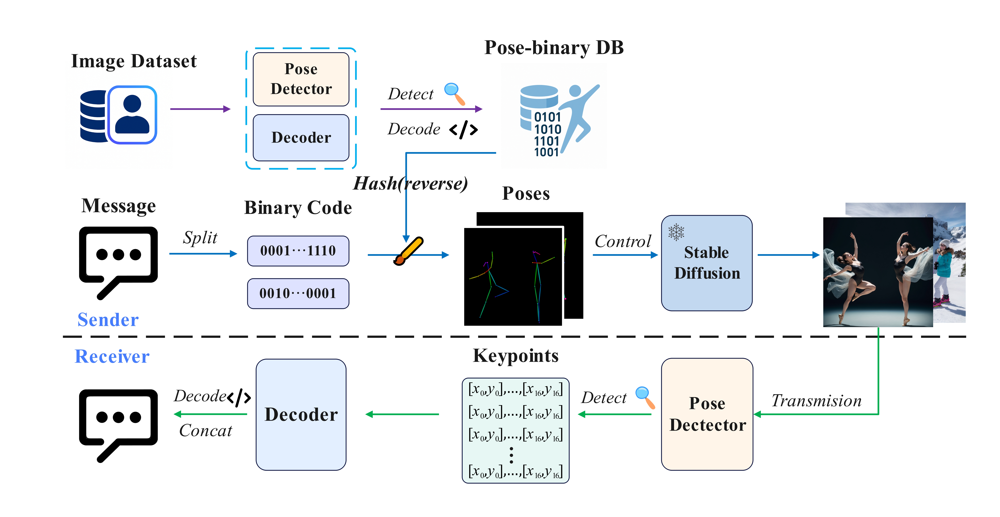

# Pose conditioned generative steganography(PCGS)



## Abstract

Todo

## Requirements

- We only test the code on **Linux**, but **Windows** may be supported as well.
- Python == 3.10,  pytorch == 2.6.0.
- cuda == 11.8  We have done all development and testing using a NVIDIA RTX 4090.

```
conda create -n pcgs python==3.10
conda activate pcgs
pip install -r requirements.txt
```

## Data preparation

**For COCO data**, please download from [COCO download](http://cocodataset.org/#download), 2017 Train/Val/Test is needed for COCO keypoints usage.

**For COCO pose label**, please download from [Download Link](https://github.com/ultralytics/assets/releases/download/v0.0.0/coco2017labels-pose.zip).

**For Viton-Hd data**, please download from [Viton-hd download](https://drive.google.com/file/d/1tLx8LRp-sxDp0EcYmYoV_vXdSc-jJ79w/view?usp=sharing).

## Model preparation

To generate images, we utilize the **Stable Diffusion WebUI** provided by **AUTOMATIC1111**, in conjunction with the **DreamShaper** pretrained model, which is based on **Stable Diffusion 1.5**. The WebUI implementation is publicly available via [Automatic111](https://github.com/AUTOMATIC1111/stable-diffusion-webui), and the DreamShaper model can be downloaded from its official release source: [DreamShaper](https://civitai.com/models/4384/dreamshaper). 

In addition, we also incorporate the **ControlNet** [(Link)](https://github.com/Mikubill/sd-webui-controlnet) and **ADetailer** [(Link)](https://github.com/Bing-su/adetailer) plugins within the WebUI to enhance pose conditioning and fine-grained facial details during image generation.

After setting up the generation models, you should run  `generate_pics/gen_1.py ` and `generate_pics/gen_2.py `  to prepare the images required for FID evaluation.

The final directory data  look like this:

```
${POSE_ROOT}
|-- data
`-- |-- coco
    |-- viton-hd
    |--example
    |--pose
    |-- source
    `-- stega 
```

To use the pose detector, please download pretrained models from [zoo](https://drive.google.com/drive/folders/1CJ1t0qsZrsNeyOhqHRXMjNKtM0QxabOV?usp=sharing) and make models directory look like this:

```
${POSE_ROOT}
|-- model
`-- |-- imagenet
    |   |-- hrnet_w32-36af842e.pth
    |-- pose_coco
    |   |-- pose_dekr_hrnetw32_coco.pth
    |   |-- yolo11n-pose.pt
    | 	`-- yolo11x-pose.pt
    |-- pose_crowdpose
    |   |-- pose_dekr_hrnetw32_crowdpose.pth
    |   `-- pose_dekr_hrnetw48_crowdpose.pth
    `-- rescore
        |-- final_rescore_coco_kpt.pth
```


## Experiments

### Attack_test

```python
cd attack_test
python test_openpose.py
python test_yolo.py
python test_dekr.py
```

### Image quality evaluation

```python
cd quality
python main.py
python fid.py
```

### Security evaluation

```python
cd security
python main.py
```

### draw_pose

```python
cd drawer
python pose_gen_1.py # use the pose keypoints from the coco label given the binary code
python pose_gen_2.py # use the pose keypoitns from the results of pose detector (yolo et al.)
```

## Acknowledgements

This code is based on [diffusers](https://github.com/huggingface/diffusers), [DEKR](https://github.com/HRNet/DEKR), [stable-diffusion-webui](https://github.com/AUTOMATIC1111/stable-diffusion-webui), [ultralytics](https://github.com/ultralytics/ultralytics).

## Citation

Todo
